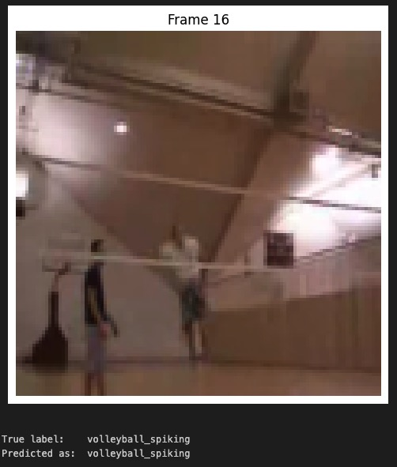
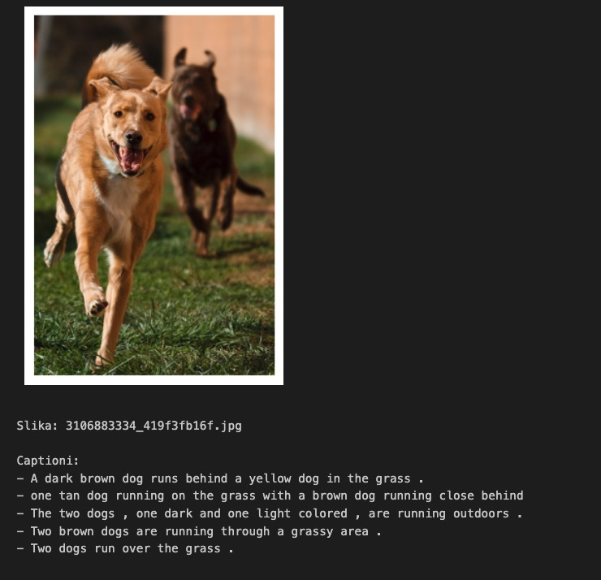

# 🧠 Hybrid Neural Networks: Vision-to-Language Tasks

This repository features a professional deep learning portfolio focused on **Hybrid Neural Network architectures** that bridge the gap between **Computer Vision (CV)** and **Natural Language Processing (NLP)**. The projects are implemented using **PyTorch** and cover three advanced multi-modal tasks.


-blue)


---

## 🚀 Projects Overview

### 1. 🎞️ Action Captioning (Video Analysis)
A comparative study of temporal feature extraction using the **UCF11 (YouTube Action)** dataset.
* **Methodology**:
    * **2D CNN + LSTM**: Sequential processing of video frames.
    * **3D CNN (C3D)**: Capturing spatial and temporal dynamics simultaneously using 3D kernels.
* **Key Notebook**: `action_captioning.ipynb`

Example of the model generating a descriptive caption by analyzing temporal features across video frames:



### 2. 🖼️ Image Captioning
Generating descriptive natural language captions for static images using an Encoder-Decoder framework.
* **Architecture**:
    * **Encoder**: Pre-trained **ResNet** for visual feature extraction.
    * **Decoder**: **LSTM** with embedding layers for text generation.
* **Dataset**: Flickr8k.
* **Key Notebook**: `image_captioning.ipynb`

Here is an example of the captions generated by the trained model:




### 3. ❓ Visual Question Answering (VQA)
A multimodal task where the system answers open-ended questions based on image content.
* **Implementation**: Fusing image features (CNN) and question embeddings (LSTM) to classify the most probable answer category.
* **Key Notebook**: `vqa.ipynb`

---

## 📂 Repository Structure

```text
.
├── action_captioning.ipynb    # Video analysis & C3D implementations
├── image_captioning.ipynb     # Image-to-text generation pipeline
├── vqa.ipynb                 # Visual Question Answering system
├── Hibridne Mreže.pptx        # Final theoretical presentation (Slides)
├── PREZA.docx                # Comprehensive project documentation
├── .gitignore                # Excludes large .pth and .pkl files
└── README.md                 # Project documentation (this file)
```

---

## 🛠️ Technical Implementation

### Hardware Acceleration (Apple Silicon)
The code is optimized for MacBook Air/Pro (M-series) using Metal Performance Shaders (MPS) for faster training and inference:
```python
# Check for Apple Silicon GPU acceleration
import torch
device = torch.device("mps") if torch.backends.mps.is_available() else torch.device("cpu")
```

### Core Libraries
* `torch` & `torchvision` (PyTorch core & pre-trained models)
* `datasets` (Hugging Face datasets for VQA)
* `PIL` & `matplotlib` (Image processing and visualization)
* `nltk` (Natural language tokenization)


